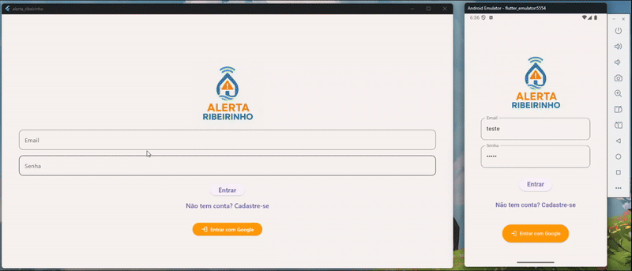

# Alerta Ribeirinho 📱⚠️

Aplicativo móvel para segurança ambiental com foco em áreas ribeirinhas. A solução utiliza mapas e geolocalização para auxiliar na visualização de regiões afetadas por possíveis enchentes ou alertas ambientais.



## Grupo
- Heloísa Santos de Sousa - 550256
- Samuel de Paula Santolim -
- Francisco Henrique Lima -
- Lucas Henrique Carrascosa -
- Pedro Reginaldo -

## 📱 Tecnologias utilizadas

- [Flutter](https://flutter.dev/) (SDK: ^3.8.0)
- [flutter_map](https://pub.dev/packages/flutter_map)
- [latlong2](https://pub.dev/packages/latlong2)
- [geolocator](https://pub.dev/packages/geolocator)
- [http](https://pub.dev/packages/http)

## ▶️ Como executar
1. **Clone o repositório**:
   ```bash
   git clone https://github.com/seu-usuario/alerta_ribeirinho.git
   cd alerta_ribeirinho ```
2. Instale as dependências:
   ``` flutter pub get ```
3. Executar o projeto
     ```
     flutter emulators --launch nome_do_emulador
     flutter run
   ```
## Compatível com
- Android
- iOS
- Windows
- MacOS
- Linux
